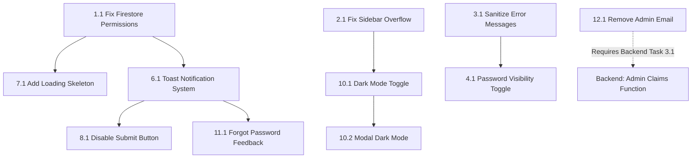

# Move2Deutschland — E2E Test Bugfix & UX Improvement Tasks

**Assigned to:** Lead Full-Stack Developer  
**Source:** E2E Test Report (2026-07-18) — Login Flow & Dashboard UI/UX  
**Priority:** Start with Task 1.1 and work sequentially  
**Date Assigned:** 2026-07-19  
**Status:** 🟡 Ready for Development

---

## Reference

All issues below were identified during end-to-end testing of the login flow (`/auth`) and user dashboard (`/dashboard`) using test account `c.essfinder@gmail.com`. Full test evidence (screenshots + browser recordings) is available in the test report artifact.

---

## 1. Fix Firestore Permission Errors (🔴 Critical — Start Here)

### Task 1.1: Resolve `Missing or insufficient permissions` on Dashboard Load
- **File:** `src/pages/Dashboard.tsx` (Lines 77–209)
- **Related:** `firestore.rules` (Line 32)
- **Bug:** The browser console logs repeated `FirebaseError: Missing or insufficient permissions` when the dashboard calls `getDoc(userDocRef)` inside `onAuthStateChanged`. The Firestore rule at line 32 requires `request.auth.token.email_verified == true` for reads, but the Firebase Auth token's `email_verified` claim may not be immediately synchronized after `onAuthStateChanged` fires — especially on first load or after page refresh.
- **Impact:** User profile data, document statuses, and opportunity card data silently fail to load. The user sees default/empty state with no explanation.
- **Fix Requirements:**
  1. Add a try/catch around all Firestore reads in `Dashboard.tsx` that gracefully handles permission errors.
  2. If permission is denied, force a token refresh with `user.getIdToken(true)` and retry the Firestore read once.
  3. If still denied, show a user-visible error banner (not `alert()`) explaining that verification may be pending, with a "Retry" button.
  4. Add a loading state (spinner or skeleton) while Firestore data is being fetched — do not render the empty dashboard immediately.
  5. Consider adding a `user.reload()` call before checking `emailVerified` to ensure the auth state is fresh.
- **Acceptance Criteria:**
  - Dashboard loads without `Missing or insufficient permissions` console errors for a verified user.
  - If a permission error occurs, the user sees a friendly message with a retry option — not a blank page.
  - A loading skeleton or spinner is visible during the Firestore fetch window.

---

## 2. Fix Sidebar Overflow — Profile & Sign Out Inaccessible (🔴 Critical)

### Task 2.1: Add Independent Scroll to Desktop Sidebar
- **File:** `src/pages/Dashboard.tsx` (Lines 517–584)
- **Bug:** The sidebar uses `min-h-screen sticky top-0` but the bottom section (user profile, Edit Profile button, "Exit to Home", and "Sign Out") is pushed down with `mt-auto`. On standard laptop viewports (≤ 800px height), these elements overflow the visible area. The sidebar has no `overflow-y-auto`, so users **cannot scroll the sidebar independently** and therefore **cannot sign out** or access Edit Profile without scrolling the entire main page to the bottom.
- **Fix Requirements:**
  1. Add `overflow-y-auto` to the `<aside>` element.
  2. Restructure the sidebar layout so the nav section scrolls but the profile/sign-out section remains pinned at the bottom (use `flex flex-col` with `flex-1 overflow-y-auto` on the nav section and a static bottom section).
  3. Test at viewport heights of 600px, 700px, 800px, and 1080px.
- **Acceptance Criteria:**
  - User profile, Edit Profile pencil icon, "Exit to Home", and "Sign Out" are always visible or scrollable-to in the sidebar on all desktop viewports.
  - Sidebar scroll does not affect main content scroll.

---

## 3. Sanitize Firebase Error Messages (🔴 Critical — Security)

### Task 3.1: Replace Raw Firebase Errors with User-Friendly Messages
- **File:** `src/pages/Auth.tsx` (Lines 112–116, Line 70, Line 138)
- **Bug:** When login, signup, Google auth, or password reset fails, the raw Firebase error message is shown directly to the user (e.g., `Firebase: Error (auth/invalid-credential).`). This exposes the auth provider, leaks technical implementation details, and may reveal whether an email exists in the system (information disclosure).
- **Fix Requirements:**
  1. Create a helper function `getAuthErrorMessage(errorCode: string): string` that maps Firebase error codes to user-friendly strings:
     - `auth/invalid-credential` → "Invalid email or password. Please try again."
     - `auth/user-not-found` → "No account found with this email. Please sign up."
     - `auth/wrong-password` → "Incorrect password. Please try again or reset your password."
     - `auth/email-already-in-use` → "An account with this email already exists. Please sign in."
     - `auth/weak-password` → "Password is too weak. Please use at least 8 characters with a mix of letters, numbers, and symbols."
     - `auth/too-many-requests` → "Too many failed attempts. Please wait a few minutes and try again."
     - `auth/network-request-failed` → "Network error. Please check your internet connection."
     - Default → "Something went wrong. Please try again later."
  2. Apply this function in all catch blocks in `Auth.tsx` (lines 112, 70, 138).
  3. Never expose `err.message` directly to the user.
- **Acceptance Criteria:**
  - No Firebase error strings are visible to end users under any failure scenario.
  - All error messages are clear, helpful, and non-technical.
  - Error messages do not confirm or deny whether a specific email exists.

---

## 4. Add Password Visibility Toggle (🟠 High)

### Task 4.1: Implement Show/Hide Password Toggle on Auth Page
- **File:** `src/pages/Auth.tsx` (Lines 322–330)
- **Bug:** The password field has no toggle to show/hide the password. This is a standard UX pattern — especially important given passwords like `Borobo1948#@` contain special characters that are easy to mistype without visual confirmation.
- **Fix Requirements:**
  1. Add an `Eye` / `EyeOff` icon toggle button inside the password input container (right side).
  2. Toggle the input `type` between `"password"` and `"text"` on click.
  3. Ensure the toggle button has `type="button"` to prevent accidental form submission.
  4. Apply the same toggle to the password field on both login and signup views.
- **Acceptance Criteria:**
  - Clicking the eye icon reveals the password; clicking again hides it.
  - Toggle works on both Sign In and Create Account forms.
  - Icon visually changes between `Eye` and `EyeOff` states.

---

## 5. Wire Up Resource Download Buttons (🟠 High)

### Task 5.1: Make Resource Hub Downloads Functional
- **File:** `src/pages/Dashboard.tsx` (Lines 491–495, 868–902)
- **Bug:** The Resource Hub displays three guides (Blocked Account Guide, Health Insurance Overview, Visa Application Checklist) with download icons and file sizes (2.4 MB, 1.8 MB, 1.2 MB). However, the download `<button>` has **no `onClick` handler or `href`** — clicking does nothing. The listed file sizes create a false promise that real files exist.
- **Fix Requirements:**
  1. **Option A (Preferred):** Upload real PDF resource files to Firebase Storage under a public `/resources/` path. Update the `resources` array with actual download URLs. Wire the download button to trigger a file download.
  2. **Option B (If no PDFs exist yet):** Replace the download button with a "Coming Soon" badge. Remove the fake file sizes. Change the button style to disabled/greyed out.
  3. If going with Option A, add a loading state to the download button while the file loads.
- **Acceptance Criteria:**
  - Download buttons either trigger a real file download or are clearly marked as "Coming Soon".
  - No misleading file sizes are shown for non-existent files.

---

## 6. Replace All `alert()` Calls with Toast Notifications (🟠 High)

### Task 6.1: Implement Toast Notification System
- **Files:** `src/pages/Auth.tsx` (Line 68), `src/pages/Dashboard.tsx` (Lines 279, 295, 375, 409, 411)
- **Bug:** Native `alert()` dialogs are used for password reset confirmation, profile save failures, upload failures, missing profile data, and application submission success. These are jarring, block the UI, cannot be styled, and look unprofessional.
- **Fix Requirements:**
  1. Install a lightweight toast library (e.g., `react-hot-toast` or `sonner`) OR create a custom `<Toast>` component with animation.
  2. Replace every `alert()` call in `Auth.tsx` and `Dashboard.tsx` with the appropriate toast type:
     - Success toasts (green): Password reset sent, profile saved, application submitted
     - Error toasts (red): Upload failed, profile save failed, permission denied
     - Warning toasts (amber): "Please complete your academic profile first"
  3. Toasts should auto-dismiss after 4–5 seconds but be manually dismissable.
  4. Position toasts at top-right on desktop, bottom-center on mobile.
- **Acceptance Criteria:**
  - Zero `alert()` calls remain in the codebase.
  - All user feedback uses styled, non-blocking toast notifications.
  - Toasts are visible on both desktop and mobile without overlapping critical UI.

---

## 7. Add Loading / Skeleton State to Dashboard (🟠 High)

### Task 7.1: Add Loading State While Firestore Data Fetches
- **File:** `src/pages/Dashboard.tsx`
- **Bug:** When the dashboard loads, there is no loading spinner, skeleton screen, or visual indicator that data is being fetched from Firestore. The page renders empty fields (blank CGPA, default "Missing" statuses) immediately. Combined with Task 1.1, this makes the page look broken on first load.
- **Fix Requirements:**
  1. Add a `isLoading` state that is `true` until Firestore data is fetched (or fails).
  2. While loading, render skeleton placeholders for: greeting name, progress tracker, academic profile card, document status cards, and resource hub.
  3. Use animated pulse/shimmer placeholders (Tailwind `animate-pulse` on grey rectangles).
  4. Only render the real content once data is loaded.
- **Acceptance Criteria:**
  - A skeleton screen is visible for the 1–3 seconds while Firestore data loads.
  - No empty/blank content is shown during the loading window.
  - The transition from skeleton to real content is smooth (no layout jump/CLS).

---

## 8. Disable "Submit Application" Until Requirements Are Met (🟠 High)

### Task 8.1: Add Validation Gating to Submit Button
- **File:** `src/pages/Dashboard.tsx` (Lines 596–601, 847–856)
- **Bug:** The "Submit Application" button (both desktop header and mobile sticky bar) is always enabled and gold-coloured, regardless of whether the user has entered a CGPA or uploaded any documents. The only validation is a runtime `alert()` inside `handleSubmitApplication`. This is misleading — users click expecting it to work and get a confusing alert.
- **Fix Requirements:**
  1. Compute an `isReadyToSubmit` boolean based on: CGPA entered (or high school exam filled) AND at least one document uploaded.
  2. Visually disable the button when `isReadyToSubmit` is false (grey out, reduced opacity, `cursor-not-allowed`).
  3. Add a tooltip or inline text below the button explaining what's missing: e.g., "Complete your academic profile and upload documents to submit."
  4. Apply to both the desktop header button and the mobile sticky bar button.
- **Acceptance Criteria:**
  - The Submit button is visually disabled until minimum requirements are met.
  - A helpful message tells the user what's still needed.
  - No `alert()` is triggered from the submit validation path (use toast from Task 6.1 instead).

---

## 9. Fix Mobile "Submit Application" Bar Overlap (🟡 Medium)

### Task 9.1: Reduce Mobile Double-Bar Height
- **File:** `src/pages/Dashboard.tsx` (Lines 847–856, 1038–1079)
- **Bug:** On mobile, the sticky "Submit Application" bar (at `bottom-[56px]`) + the bottom navigation bar (at `bottom-0`) together consume ~110px of vertical space, significantly reducing viewable content.
- **Fix Requirements:**
  1. Integrate the submit action into the bottom navigation bar instead of having a separate sticky bar. Add "Submit" as a primary tab item (gold/highlighted) OR
  2. Make the submit bar collapsible — show it only when the user scrolls to the document upload section.
  3. Ensure the content below is not hidden behind the bars (`pb-` padding adjustment).
- **Acceptance Criteria:**
  - Mobile users have at least 75% of viewport height available for content.
  - The submit action is still easily accessible.

---

## 10. Add Dark Mode Toggle (🟡 Medium)

### Task 10.1: Implement Theme Switcher
- **Files:** Global — `src/pages/Dashboard.tsx`, `src/pages/Auth.tsx`, `src/components/Navbar.tsx`
- **Bug:** Tailwind `dark:` variant classes are extensively used throughout the entire codebase, but there is **no toggle switch** anywhere in the UI for users to switch between light and dark modes. The dark mode is completely inaccessible.
- **Fix Requirements:**
  1. Add a `Sun`/`Moon` toggle icon in the dashboard sidebar and the auth page.
  2. Store the preference in `localStorage` (key: `theme`) and apply the `dark` class to `<html>`.
  3. Default to the user's OS preference via `prefers-color-scheme` media query.
  4. Ensure all existing `dark:` classes work correctly when dark mode is activated (audit the Edit Profile modal specifically — Task 10.2).
- **Acceptance Criteria:**
  - A theme toggle is available on the dashboard sidebar and auth page.
  - Theme preference persists across sessions via localStorage.
  - All pages render correctly in both light and dark mode.

### Task 10.2: Fix Edit Profile Modal Dark Mode
- **File:** `src/pages/Dashboard.tsx` (Lines 924–1036)
- **Bug:** The Edit Profile modal uses hardcoded light-theme styles on the modal body (`bg-white/90`, `text-slate-700`, `bg-white/50` on inputs) without corresponding `dark:` variants. If dark mode is activated, this modal will look broken.
- **Fix Requirements:**
  1. Add `dark:` variants to all elements inside the modal: background, text colours, input backgrounds, borders, and button styles.
- **Acceptance Criteria:**
  - Edit Profile modal is fully readable and styled correctly in dark mode.

---

## 11. Fix Forgot Password Success Feedback (🟡 Medium)

### Task 11.1: Replace `alert()` on Password Reset
- **File:** `src/pages/Auth.tsx` (Line 68)
- **Note:** This will be resolved automatically if Task 6.1 (toast system) is completed first. If completing this task independently:
- **Fix Requirements:**
  1. Replace `alert('Password reset email sent! Please check your inbox.')` with an inline success banner within the form.
  2. Auto-switch back to the login view after 3 seconds.
- **Acceptance Criteria:**
  - Password reset confirmation is shown inline, not as a browser alert.

---

## 12. Remove Hardcoded Admin Email from Client Code (🔵 Low)

### Task 12.1: Remove Admin Email Fallback
- **File:** `src/utils/auth.ts` (Line 18, Line 26)
- **Bug:** The fallback admin check `user.email === 'chimadayo43@gmail.com'` is hardcoded in the client-side JavaScript bundle. While Firestore rules correctly use Custom Claims, exposing the admin email in client code is a security smell.
- **Fix Requirements:**
  1. Remove the email fallback from `checkIsAdmin()` — rely solely on `tokenResult.claims.admin`.
  2. Remove `checkIsAdminSync()` entirely (it only checks the hardcoded email) and replace its call site in `Dashboard.tsx` line 547 with an async check or a state variable set during the initial auth load.
  3. **Prerequisite:** Ensure the Cloud Function from `BACKEND_TASKS.md` Task 3.1 (Admin Claims Trigger) is deployed first so the admin user actually has the custom claim set.
- **Acceptance Criteria:**
  - No admin email addresses are present in the client-side source code.
  - Admin detection works exclusively via Firebase Custom Claims.

---

## 13. Verify WhatsApp Support Number (🔵 Low)

### Task 13.1: Replace Placeholder WhatsApp Number
- **File:** `src/pages/Dashboard.tsx` (Line 910)
- **Bug:** The "Contact Support" button links to `https://wa.me/2348123456789` which appears to be a placeholder Nigerian phone number.
- **Fix Requirements:**
  1. Confirm the actual support WhatsApp number with the product owner.
  2. Replace the placeholder number in the `href`.
  3. Consider extracting this to an environment variable or config constant.
- **Acceptance Criteria:**
  - The "Contact Support" button opens a real WhatsApp conversation.

---

## 14. Replace Stock Photos in Social Proof (🔵 Low)

### Task 14.1: Use Real Student Photos
- **File:** `src/pages/Auth.tsx` (Lines 181–185, 211–215)
- **Bug:** The "Join 500+ Nigerian students" avatar stack uses Unsplash stock photos. This reduces trust and authenticity.
- **Fix Requirements:**
  1. Source 4 real student photos (with consent) from the testimonials/success stories.
  2. Optimise to 100x100 WebP and host in Firebase Storage or `/public/`.
  3. Replace the Unsplash URLs with local/Storage URLs.
- **Acceptance Criteria:**
  - Social proof avatars show real (or team-approved) photos, not generic stock images.
  - Images are served from project-controlled hosting, not external Unsplash hotlinks.

---

## Task Dependency Graph

---

## Completion Checklist

| # | Task | Priority | Status |
|---|------|----------|--------|
| 1.1 | Fix Firestore permission errors | 🔴 Critical | `[x]` |
| 2.1 | Fix sidebar overflow | 🔴 Critical | `[x]` |
| 3.1 | Sanitize Firebase error messages | 🔴 Critical | `[x]` |
| 4.1 | Add password visibility toggle | 🟠 High | `[x]` |
| 5.1 | Wire up resource downloads | 🟠 High | `[x]` |
| 6.1 | Replace `alert()` with toast system | 🟠 High | `[x]` |
| 7.1 | Add loading/skeleton state | 🟠 High | `[x]` |
| 8.1 | Disable Submit until ready | 🟠 High | `[x]` |
| 9.1 | Fix mobile double-bar overlap | 🟡 Medium | `[ ]` |
| 10.1 | Add dark mode toggle | 🟡 Medium | `[x]` |
| 10.2 | Fix modal dark mode | 🟡 Medium | `[x]` |
| 11.1 | Forgot password inline feedback | 🟡 Medium | `[ ]` |
| 12.1 | Remove hardcoded admin email | 🔵 Low | `[ ]` |
| 13.1 | Verify WhatsApp number | 🔵 Low | `[ ]` |
| 14.1 | Replace stock photos | 🔵 Low | `[ ]` |

---

## Acceptance Criteria (Overall)

This task list is considered complete when:

1. All checklist items above are marked `[x]`
2. Zero `alert()` calls remain in the codebase
3. Zero Firebase error strings are exposed to end users
4. Sign Out and Edit Profile are accessible on all viewport sizes without scrolling the main page
5. Dashboard shows a loading state while Firestore data fetches
6. Resource downloads either work or are clearly marked "Coming Soon"
7. `npm run lint` passes with zero errors
8. All fixes verified at 375px, 768px, 1024px, and 1440px breakpoints
